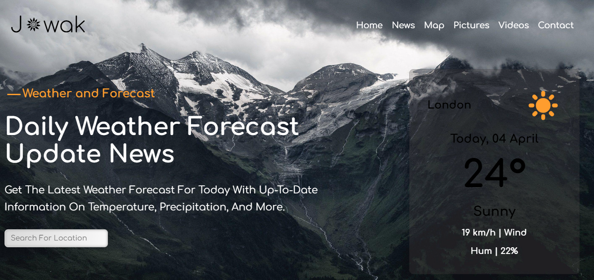

# Jowak: Climate & Weather Dashboard 🌍
## 💻 Project Preview



Jowak is a sophisticated, real-time weather tracking application that provides users with accurate climate insights. The app is built with a focus on high performance, aesthetic UI/UX, and seamless integration with external data services.

## 🛠 Technical Overview
This project demonstrates proficiency in modern web development, specifically in handling asynchronous data and dynamic UI updates.

- **Frontend Architecture:** Built using HTML5, CSS3, and Vanilla JavaScript (ES6+).
- **API Integration:** Utilizes **RESTful JSON APIs** to fetch and parse real-time meteorological data.
- **Data Handling:** Implements `fetch` requests and processes complex **JSON** response structures to dynamically update the DOM.
- **Dynamic Styling:** Features a custom dark/light theme engine, responsive grid layouts, and advanced CSS animations for a polished user experience.

## 🚀 Key Features

- **Live Weather Data:** Accurate updates using JSON API integration.
- **Dynamic Theme Engine:** Seamless switching between Light/Dark modes.
- **Search History:** Save and quickly access recent city searches via LocalStorage.
- **Responsive Design:** Fluid layout for mobile, tablet, and desktop.
- **Smart Feedback:** Intuitive loading states and error handling for invalid city searches.
- **Interactive UI:** Smooth CSS animations and transitions for an engaging experience.

## 📦 How It Works
The application communicates with a weather service provider. It sends an HTTP request, receives the response in **JSON format**, and parses this data to display dynamic information on the dashboard, such as current weather conditions and live temperature updates.

## 🚀 Getting Started

1. Clone the repository:
   ```bash
   git clone [https://github.com/nouramohamed-eng/Jowak.git](https://github.com/nouramohamed-eng/Jowak.git)