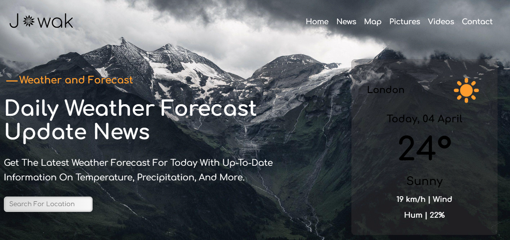

# Jowak: Climate & Weather Dashboard 🌍

## 💻 Project Preview



Jowak is a weather dashboard application that displays climate insights through a polished, interactive UI. The app is built with a focus on performance, accessibility, and clean design patterns.

## 🛠 Technical Overview

- **Frontend Architecture:** Built using HTML5, CSS3, and Vanilla JavaScript (ES6+).
- **Data Handling:** Weather and location data is structured in JSON format and dynamically rendered to the DOM using JavaScript.
- **Dynamic Styling:** Features a custom dark/light theme engine, responsive grid layouts, and CSS animations for a polished user experience.

## 🚀 Key Features

- **Interactive Weather Cards:** Dynamically rendered from structured JSON data.
- **Dynamic Theme Engine:** Seamless switching between Light/Dark modes, saved via LocalStorage.
- **Location Search:** Searchable dropdown for browsing available cities.
- **Responsive Design:** Fluid layout for mobile, tablet, and desktop.
- **Interactive UI:** Smooth CSS animations and transitions for an engaging experience.

## 📦 How It Works

Weather and location data is structured in JSON files within the project. JavaScript reads this data and dynamically renders it into the DOM, generating weather cards, forecasts, and location details on the dashboard.

## 🚀 Getting Started

1. Clone the repository:
```bash
   git clone https://github.com/nouramohamed-eng/Jowak.git
```

2. Navigate to the project folder:
```bash
   cd Jowak
```

3. Open `home.html` in your browser, or use a local server (e.g., Live Server extension in VS Code).

## 🔗 Live Demo

[View Live Website](https://nouramohamed-eng.github.io/Jowak/home.html)